<!-- Generated by tools/build.py from profile.toml. Edit those, not this file. -->

<a href="https://sebastienrousseau.com"><picture><source media="(prefers-color-scheme: dark)" srcset="assets/hero-dark.svg"></picture></a>

<a href="https://sebastienrousseau.com">Website</a> &nbsp;·&nbsp; <a href="https://www.linkedin.com/in/sebastienrousseau/">LinkedIn</a> &nbsp;·&nbsp; <a href="https://x.com/wwdseb">X</a> &nbsp;·&nbsp; <a href="https://medium.com/@BankingOnQuantum">Medium</a> &nbsp;·&nbsp; <a href="https://www.youtube.com/@BankingOnQuantum">YouTube</a> &nbsp;·&nbsp; <a href="https://news.bankingonquantum.com">Newsletter</a>

<picture><source media="(prefers-color-scheme: dark)" srcset="assets/numbers-dark.svg">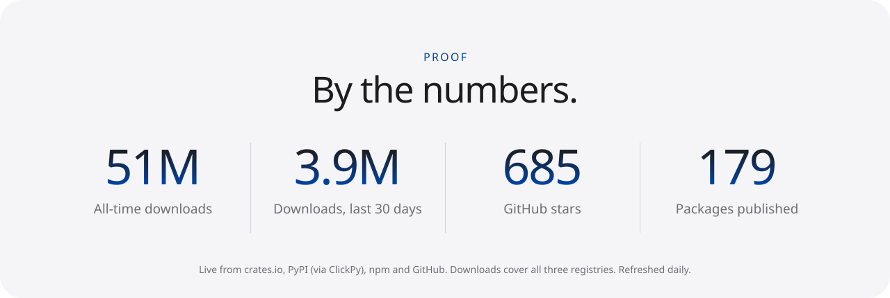</picture>

<picture><source media="(prefers-color-scheme: dark)" srcset="assets/section-payments-dark.svg">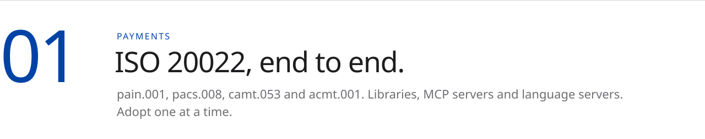</picture>

<a href="https://github.com/sebastienrousseau/pain001"><picture><source media="(prefers-color-scheme: dark)" srcset="assets/card-pain001-dark.svg">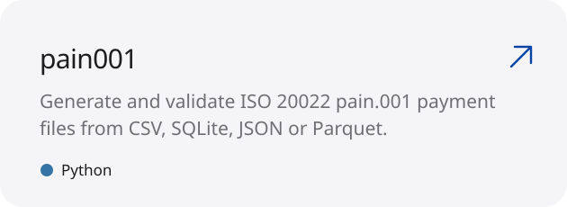</picture></a>
<a href="https://github.com/sebastienrousseau/pacs008"><picture><source media="(prefers-color-scheme: dark)" srcset="assets/card-pacs008-dark.svg">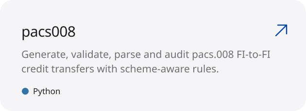</picture></a>
<a href="https://github.com/sebastienrousseau/bankstatementparser"><picture><source media="(prefers-color-scheme: dark)" srcset="assets/card-bankstatementparser-dark.svg">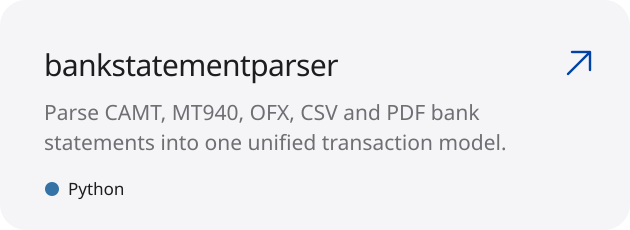</picture></a>
<a href="https://github.com/sebastienrousseau/iso20022-mcp"><picture><source media="(prefers-color-scheme: dark)" srcset="assets/card-iso20022-mcp-dark.svg">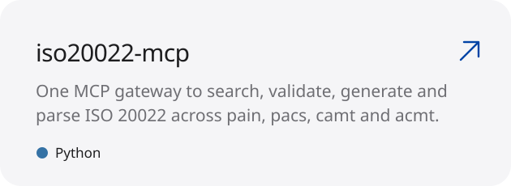</picture></a>

<a href="https://sebastienrousseau.com/projects-payments/">Learn more about Payments ›</a>

<picture><source media="(prefers-color-scheme: dark)" srcset="assets/section-security-dark.svg">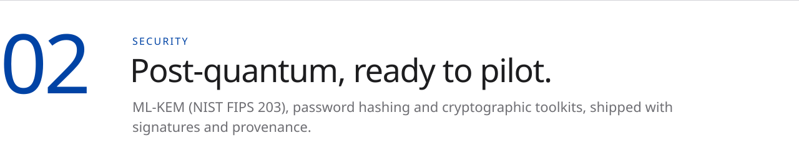</picture>

<a href="https://github.com/sebastienrousseau/kyberlib"><picture><source media="(prefers-color-scheme: dark)" srcset="assets/card-kyberlib-dark.svg"></picture></a>
<a href="https://github.com/sebastienrousseau/crypto-service"><picture><source media="(prefers-color-scheme: dark)" srcset="assets/card-crypto-service-dark.svg">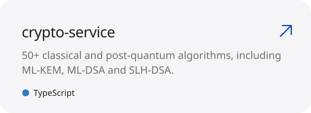</picture></a>
<a href="https://github.com/sebastienrousseau/hsh"><picture><source media="(prefers-color-scheme: dark)" srcset="assets/card-hsh-dark.svg">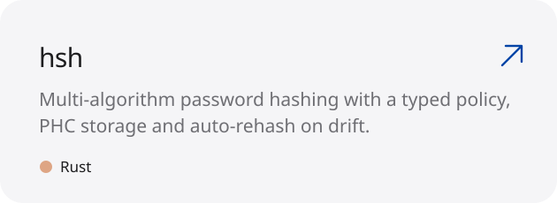</picture></a>
<a href="https://github.com/sebastienrousseau/passmcp"><picture><source media="(prefers-color-scheme: dark)" srcset="assets/card-passmcp-dark.svg">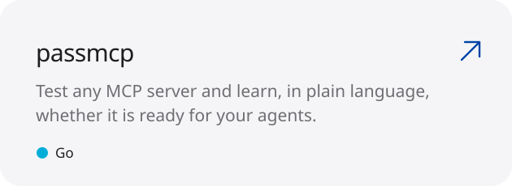</picture></a>

<a href="https://sebastienrousseau.com/projects-post-quantum/">Learn more about Security ›</a>

<picture><source media="(prefers-color-scheme: dark)" srcset="assets/section-tooling-dark.svg">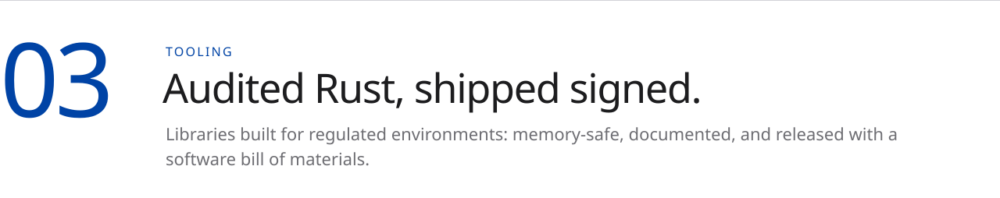</picture>

<a href="https://github.com/sebastienrousseau/static-site-generator"><picture><source media="(prefers-color-scheme: dark)" srcset="assets/card-static-site-generator-dark.svg">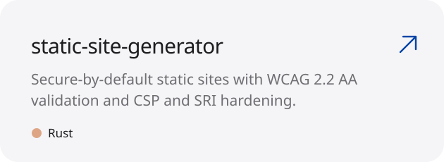</picture></a>
<a href="https://github.com/sebastienrousseau/noyalib"><picture><source media="(prefers-color-scheme: dark)" srcset="assets/card-noyalib-dark.svg">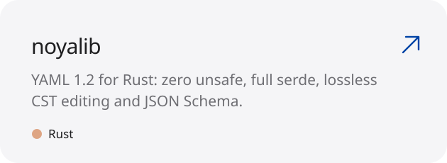</picture></a>
<a href="https://github.com/sebastienrousseau/rlg"><picture><source media="(prefers-color-scheme: dark)" srcset="assets/card-rlg-dark.svg">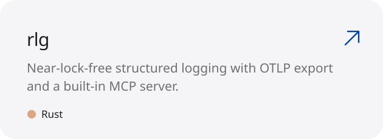</picture></a>
<a href="https://github.com/sebastienrousseau/libmake"><picture><source media="(prefers-color-scheme: dark)" srcset="assets/card-libmake-dark.svg">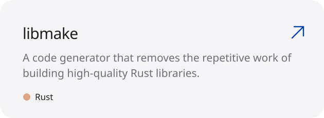</picture></a>

<a href="https://sebastienrousseau.com/projects-developer-platform/">Learn more about Tooling ›</a>

<picture><source media="(prefers-color-scheme: dark)" srcset="assets/section-platform-dark.svg">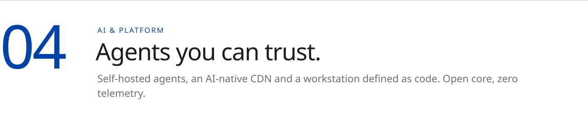</picture>

<a href="https://github.com/sebastienrousseau/rousseau-agent"><picture><source media="(prefers-color-scheme: dark)" srcset="assets/card-rousseau-agent-dark.svg">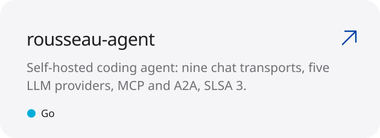</picture></a>
<a href="https://github.com/sebastienrousseau/cloudcdn.pro"><picture><source media="(prefers-color-scheme: dark)" srcset="assets/card-cloudcdn.pro-dark.svg">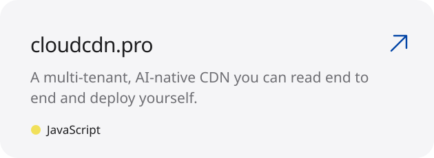</picture></a>
<a href="https://github.com/sebastienrousseau/dotfiles"><picture><source media="(prefers-color-scheme: dark)" srcset="assets/card-dotfiles-dark.svg">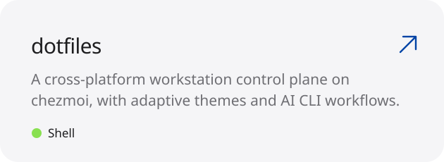</picture></a>
<a href="https://github.com/sebastienrousseau/password-generator"><picture><source media="(prefers-color-scheme: dark)" srcset="assets/card-password-generator-dark.svg">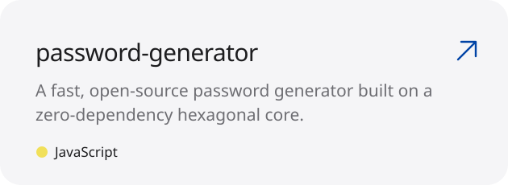</picture></a>

<a href="https://sebastienrousseau.com/projects/">Learn more about AI & Platform ›</a>

<a href="https://emergingpaymentsasia.org/wp-content/uploads/2025/09/Quantum-Safe-Payments-Why-the-Payments-Industry-Must-Act-Now.pdf"><picture><source media="(prefers-color-scheme: dark)" srcset="assets/paper-dark.svg">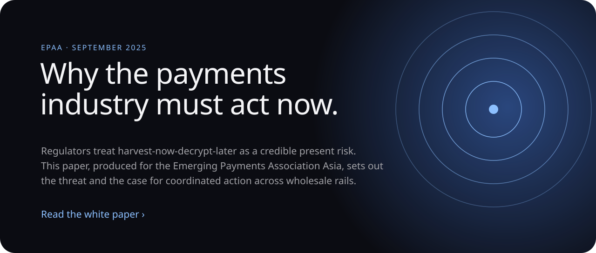</picture></a>

<picture><source media="(prefers-color-scheme: dark)" srcset="assets/desk-dark.svg"></picture>

<a href="https://sebastienrousseau.com/2026-08-04-data-act-cloud-switching-dora-exit-strategies-2026/"><picture><source media="(prefers-color-scheme: dark)" srcset="assets/article-1-dark.svg">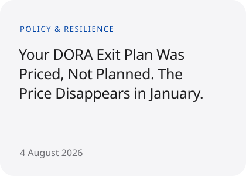</picture></a>
<a href="https://sebastienrousseau.com/2026-08-03-cyber-resilience-act-article-14-reporting-banks-2026/"><picture><source media="(prefers-color-scheme: dark)" srcset="assets/article-2-dark.svg">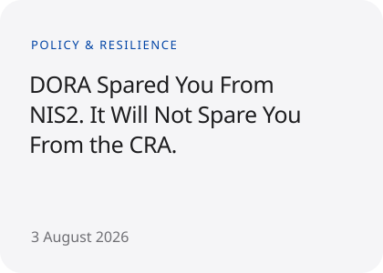</picture></a>
<a href="https://sebastienrousseau.com/2026-08-02-ai-act-article-50-transparency-banks-omnibus-2026/"><picture><source media="(prefers-color-scheme: dark)" srcset="assets/article-3-dark.svg">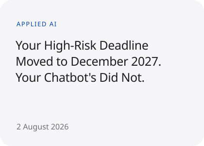</picture></a>

<a href="https://sebastienrousseau.com/articles/">See all articles ›</a>

<a href="https://sebastienrousseau.com/contact/"><picture><source media="(prefers-color-scheme: dark)" srcset="assets/finale-dark.svg">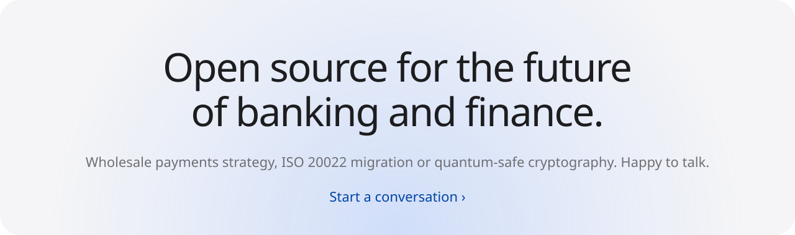</picture></a>

Built from <a href="profile.toml">profile.toml</a> in the typefaces and colours of <a href="https://sebastienrousseau.com">sebastienrousseau.com</a>.

